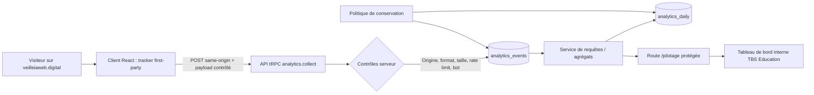

# Mesure first-party de la veille IA & Web

**Statut :** proposition technique à arbitrer  
**Périmètre :** `veilleiaweb.digital` et ses sous-domaines publiés  
**Public :** TBS Education — Direction digitale, data/analytics, DSI, DPO, communication et marketing  
**Version :** 1.0 — 17 août 2026

> **Point de conformité.** Je ne suis pas juriste : cette note est une spécification de travail, pas un avis juridique. Le DPO de TBS Education doit valider les finalités, le régime de consentement, les durées de conservation et la documentation avant mise en production. La CNIL encadre l’exemption de consentement de manière stricte : finalité limitée à la mesure d’audience pour le seul éditeur, statistiques anonymes, absence de recoupement ou de suivi inter-sites, information des personnes et durées adaptées. [1]

## 1. Décision recommandée

La recommandation est de construire une **mesure first-party dédiée, minimale et gouvernée** dans le projet Veille IA & Web, plutôt que de dépendre de Google Analytics. Elle doit mesurer l’utilité éditoriale de la veille — consultation des éditions, analyses ouvertes, sources cliquées, archives lues et canaux d’acquisition — sans créer un outil de profilage individuel.

Le projet actuel contient déjà un script Umami injecté via `VITE_ANALYTICS_ENDPOINT` et `VITE_ANALYTICS_WEBSITE_ID`. Cette mesure de plateforme peut continuer à servir de repère de volumétrie, mais elle ne fournit pas le schéma événementiel propre à la veille, son modèle de conservation ou son tableau de bord métier. La nouvelle collecte ne doit pas doubler artificiellement les KPI : le tableau de bord first-party devient la référence de pilotage éditorial ; Umami reste un contrôle de cohérence optionnel.

| Élément | Choix recommandé | Raison |
|---|---|---|
| Infrastructure | Évolution du projet vers **web-db-user** | Un site statique ne peut pas conserver, agréger et sécuriser ses propres événements. |
| Collecte | Point d’entrée same-origin `POST /api/trpc/analytics.collect` | Pas de script tiers, contrôle du format, des données et de la rétention. |
| Base de données | Tables d’événements minimisées + agrégats quotidiens | Séparer l’usage analytique fin du pilotage de long terme. |
| Identification | Session opaque first-party ; pas de fingerprinting | Mesurer les parcours sans tenter d’identifier une personne. |
| Dashboard | Route d’administration protégée par Manus OAuth et rôle `admin` | Les métriques de consultation ne doivent pas être publiques. |
| Référence de reporting | Agrégats first-party | Éviter les écarts de définition et le double comptage entre outils. |

## 2. Architecture cible



Le composant client ne transmet qu’un événement autorisé et des propriétés dans une liste blanche. L’API effectue la normalisation, supprime les données inutiles et refuse les formats inattendus. Elle ne stocke ni adresse IP, ni URL complète avec paramètres, ni contenu de formulaire, ni texte libre, ni identifiant CRM, ni adresse électronique.

Le dashboard appelle exclusivement des procédures tRPC protégées. Il ne lit pas les événements individuels sauf besoin d’investigation exceptionnel, limité aux personnes habilitées. Les indicateurs courants sont calculés sur les agrégats quotidiens et par édition.

### Pré-requis applicatifs

L’architecture nécessite l’upgrade **web-db-user** avant développement. Cette évolution apporte une base de données, l’API serveur, tRPC et Manus OAuth. Elle n’implique pas d’authentification pour le lecteur public : la collecte reste publique, tandis que la consultation du dashboard est restreinte aux administrateurs.

Les opérations doivent respecter cet ordre :

| Étape | Livrable technique | Point de contrôle |
|---:|---|---|
| 1 | Upgrade `web-db-user` | Projet full-stack, base et routes tRPC disponibles |
| 2 | Schéma Drizzle + migration SQL | Validation DSI/DPO du dictionnaire de données |
| 3 | Collecteur public sécurisé | Tests de rejet : origine, payload, volume et robot |
| 4 | Instrumentation React | Événements reçus sans données de formulaire ni URL brute |
| 5 | Dashboard admin | Contrôle des rôles et exactitude des agrégats |
| 6 | Rétention / purge | Procédure testée et journalisée |
| 7 | Recette | Comparaison de cohérence avec les statistiques d’hébergement/Umami |

## 3. Deux niveaux de collecte à arbitrer

La configuration doit rester réversible. Le niveau 1 est le socle recommandé ; le niveau 2 apporte une meilleure lecture des parcours, mais doit être explicitement validé par le DPO et la CMP selon la configuration retenue.

| Niveau | Fonctionnement | Données obtenues | Régime à valider |
|---|---|---|---|
| **Niveau 1 — Audience agrégée** | Aucun identifiant persistant. Les hits sont consolidés au serveur par jour, route, édition et canal. | Pages vues, éditions consultées, sources cliquées, canaux, volumes quotidiens. | Candidat à une mesure strictement nécessaire ; à valider au regard de la configuration effective. |
| **Niveau 2 — Engagement de session** | Identifiant de session first-party opaque et limité. Aucun suivi inter-sites, aucun rapprochement CRM. | Sessions, profondeur de consultation, récurrence de session, parcours de navigation et taux d’engagement. | À soumettre au DPO/CMP ; déclenchement seulement après consentement si l’exemption ne peut être démontrée. |

La recommandation est de développer les deux modes dès l’origine, mais de rendre le niveau 2 **désactivé par configuration**. Cela permet d’activer la collecte avancée ultérieurement sans réécrire le site ni dégrader les principes de minimisation.

## 4. Modèle de données

### 4.1 Table `analytics_events`

Cette table conserve les événements unitaires sur une période courte. Les colonnes sont volontairement explicites afin d’éviter une propriété JSON libre capable de capturer par erreur une donnée personnelle.

| Colonne | Type indicatif | Usage | Règle de minimisation |
|---|---|---|---|
| `id` | UUID | Déduplication technique de l’événement | Identifiant aléatoire, sans donnée métier |
| `occurredAt` | timestamp UTC | Date de l’action côté visiteur | Horodatage UTC uniquement |
| `receivedAt` | timestamp UTC | Contrôle de réception et décalage | Horodatage serveur |
| `eventName` | enum | Type d’événement autorisé | Liste blanche stricte |
| `sessionKeyHash` | varchar | Regrouper les actions d’une session au niveau 2 | HMAC serveur d’un identifiant opaque ; nul au niveau 1 |
| `week` | smallint | Édition consultée | Valeur 1–53, pas de texte libre |
| `route` | enum | Vue fonctionnelle : `home`, `archives`, `timeline`, `about` | Jamais de chemin libre ni de query string |
| `domainCode` | enum nullable | Domaine éditorial concerné | Code issu du référentiel local |
| `sourcePublisher` | enum nullable | Éditeur de la source externe cliquée | Nom normalisé, pas d’URL complète |
| `target` | enum nullable | Élément de navigation ou contenu ciblé | Liste blanche |
| `referrerChannel` | enum | `direct`, `search`, `social`, `email`, `partner`, `internal`, `unknown` | Déduit côté serveur puis URL brute supprimée |
| `utmSource` / `utmMedium` / `utmCampaign` | varchar courte nullable | Attribution de campagne | Format normalisé, longueur limitée, valeurs sans email/téléphone/identifiant |
| `engagementMs` | integer nullable | Durée déclarée à la fermeture d’une analyse | Bornée et arrondie ; pas de suivi continu |
| `collectionMode` | enum | `aggregate` ou `consented_session` | Traçabilité du régime de collecte |

### 4.2 Table `analytics_daily`

Cette table est la source principale du tableau de bord. Elle agrège les événements pour limiter les requêtes sur le détail et autoriser une conservation plus longue du pilotage.

| Colonne | Granularité | Exemples d’usage |
|---|---|---|
| `day` | Jour UTC | Tendance des consultations |
| `week` | Édition de veille | Comparaison S34, S35, S36 |
| `route` | Section du site | Part de trafic des archives ou de la timeline |
| `referrerChannel` | Canal normalisé | Acquisition organique, email, accès direct |
| `eventName` | Événement | Sources cliquées, ouvertures d’analyses |
| `domainCode` | Domaine de veille | Hiérarchie des intérêts éditoriaux |
| `eventCount` | Compteur | Volume d’actions |
| `sessionCount` | Compteur estimé, niveau 2 uniquement | Sessions engagées |
| `updatedAt` | Horodatage | Traçabilité du calcul |

### 4.3 Durées de conservation proposées

La CNIL indique que les traceurs exemptés doivent être limités à une durée pertinente, donne comme exemple une durée de vie de treize mois non prolongée automatiquement, et recommande une conservation des informations collectées de vingt-cinq mois au maximum, sous réserve d’un réexamen périodique. [1] La proposition ci-dessous est plus restrictive pour l’événementiel détaillé.

| Jeu de données | Conservation proposée | Justification |
|---|---:|---|
| Événements unitaires | **90 jours** | Analyse de recette, qualité de collecte et compréhension récente des usages |
| Agrégats quotidiens | **25 mois maximum** | Comparaisons éditoriales saisonnières et suivi de tendances |
| Session opaque, si niveau 2 | **30 minutes d’inactivité** | Reconstruction d’une visite, sans profil de long terme |
| Traceur persistant, si DPO l’autorise | **À paramétrer selon l’analyse de conformité** | Ne pas l’activer par défaut ; éviter tout renouvellement automatique |
| Journaux techniques d’erreur | **30 jours** | Sécurité et diagnostic, hors données d’usage métier |

Un travail planifié de purge doit supprimer les événements unitaires arrivés à échéance. Les agrégats expirés doivent être supprimés ou consolidés à une granularité mensuelle non réidentifiante, selon la décision DPO.

## 5. Plan de marquage

### 5.1 Événements à mettre en production

Le plan privilégie les interactions qui répondent à une question de pilotage. Il exclut les clics décoratifs, les mouvements de souris, la saisie utilisateur et les scrolls continus, trop coûteux et peu utiles.

| Événement | Déclencheur | Paramètres autorisés | Question métier | Priorité |
|---|---|---|---|---|
| `page_view` | Chargement d’une route | `route`, `week`, `referrerChannel`, UTM normalisés | Quelle audience atteint chaque section ? | P0 |
| `edition_view` | Affichage d’une édition courante ou archive | `week`, `route` | Quelles semaines sont consultées, y compris après publication ? | P0 |
| `domain_open` | Ouverture de la modale d’un domaine | `week`, `domainCode`, `badge` | Quels sujets déclenchent une lecture approfondie ? | P0 |
| `domain_analysis_flip` | Passage sur la face analyse détaillée | `week`, `domainCode` | La synthèse suffit-elle ou l’analyse complète est-elle consultée ? | P1 |
| `domain_close` | Fermeture de la modale | `week`, `domainCode`, `engagementMs` borné | Quelle durée d’attention approximative pour une analyse ? | P1 |
| `source_click` | Clic vers une source externe | `week`, `domainCode`, `sourcePublisher` | Quelles références suscitent une vérification ou un approfondissement ? | P0 |
| `archive_view` | Affichage de la page archives | `route` | Les contenus historiques sont-ils recherchés ? | P1 |
| `archive_edition_open` | Ouverture d’une édition historique | `week` | Quelles semaines restent utiles dans le temps ? | P0 |
| `timeline_view` | Affichage de la timeline | `route` | La vue d’évolution est-elle consultée ? | P2 |
| `navigation_click` | Clic de navigation interne | `target`, `route` | Le parcours d’accès est-il compréhensible ? | P2 |
| `consent_state` | Changement de consentement, si niveau 2 | `collectionMode` uniquement | Contrôler le fonctionnement des régimes de collecte | P0 conditionnel |

### 5.2 Événements explicitement exclus

| Élément exclu | Motif |
|---|---|
| Adresse IP, géolocalisation fine, empreinte navigateur, user-agent brut | Inutiles au pilotage éditorial et source de risque disproportionnée |
| Emails, noms, identifiants CRM, contenu de formulaire | Sans relation avec la consultation de la veille et à ne jamais envoyer dans un outil analytics |
| URL complète, paramètres de recherche, fragments | Risque de fuite d’identifiants ou de paramètres UTM non maîtrisés |
| Texte de prompt, texte saisi, recherche libre | Pas de fonctionnalité de recherche nécessaire au KPI de consultation ; risque de collecte de données personnelles |
| Enregistrement de session, heatmap, clics exhaustifs, scroll continu | Disproportionnés au besoin, difficiles à interpréter et non requis pour les décisions prévues |

### 5.3 Contrat d’appel client

Le client React encapsule toute collecte dans une fonction unique, sans appel direct depuis les composants. Exemple de contrat indicatif :

```ts
type AnalyticsEvent =
  | { name: "page_view"; route: "home" | "archives" | "timeline" | "about"; week?: number }
  | { name: "edition_view"; week: number; route: "home" | "archives" }
  | { name: "domain_open"; week: number; domainCode: string; badge: "CRITIQUE" | "IMPORTANT" | "À SURVEILLER" }
  | { name: "domain_analysis_flip"; week: number; domainCode: string }
  | { name: "domain_close"; week: number; domainCode: string; engagementMs: number }
  | { name: "source_click"; week: number; domainCode: string; sourcePublisher: string }
  | { name: "archive_edition_open"; week: number }
  | { name: "navigation_click"; target: "current" | "archives" | "timeline" | "about" };
```

La fonction `track()` valide le mode de collecte, tronque et normalise les valeurs, ajoute un `event_id` aléatoire et utilise `navigator.sendBeacon()` avec repli sur `fetch(..., { keepalive: true })`. Le client ne lit ni n’envoie directement `document.referrer` complet ; le serveur catégorise le référent reçu dans l’en-tête HTTP, puis le rejette.

## 6. API et contrôles de sécurité

| Contrôle | Règle de mise en œuvre |
|---|---|
| Schéma d’entrée | Validation Zod sur une union d’événements connue ; aucune propriété supplémentaire acceptée |
| Origine | Accepter exclusivement les origines publiées de la veille ; refuser CORS ouvert |
| Taille | Payload JSON limité, par exemple à 2 Ko ; un événement par requête |
| Cadence | Rate limit par jeton de session éphémère et par fenêtre courte ; réponse neutre en cas de dépassement |
| Bots | Écarter les robots connus après lecture du user-agent en mémoire ; ne pas le persister brut |
| Session | Jeton opaque same-site ; stockage haché côté base si le mode session est activé |
| Déduplication | Contrainte unique sur `event_id` ; filtre complémentaire sur événement identique dans une fenêtre courte |
| Secrets | Clé HMAC et accès base uniquement côté serveur ; aucune clé analytics dans le bundle public |
| Droits | `analytics.collect` public ; `analytics.dashboard` et export CSV réservés au rôle `admin` |
| Exports | Agrégats uniquement par défaut ; événementiel détaillé réservé à une investigation documentée |

## 7. Tableau de bord de pilotage

Le tableau de bord est une route interne, par exemple `/pilotage`, distincte du site public. Il doit utiliser le composant de layout d’administration fourni par le projet full-stack et vérifier le rôle `admin`. Il n’est pas nécessaire de créer un tableau de bord public ni de modifier la page d’accueil de la veille.

### Vue « Synthèse »

| KPI | Définition | Fenêtre par défaut | Décision associée |
|---|---|---|---|
| Consultations d’éditions | Nombre de `edition_view` | 30 jours | Mesurer la diffusion réelle de la veille |
| Éditions les plus consultées | `edition_view` par numéro de semaine | 90 jours | Identifier les sujets à forte durée de vie |
| Taux d’ouverture d’analyse | `domain_open` / `edition_view` | 30 jours | Mesurer l’intérêt pour les cartes détaillées |
| Taux d’analyse complète | `domain_analysis_flip` / `domain_open` | 30 jours | Évaluer le besoin de profondeur éditoriale |
| Taux de clic source | `source_click` / `domain_open` | 30 jours | Identifier les analyses qui déclenchent une vérification |
| Domaines les plus lus | `domain_open` par `domainCode` | 90 jours | Ajuster les priorités éditoriales |
| Acquisition par canal | `edition_view` par `referrerChannel` et UTM | 30 jours | Évaluer newsletter, intranet, SEO et accès direct |
| Sessions engagées | Sessions avec au moins deux événements significatifs | 30 jours | Lecture qualitative ; disponible seulement au niveau 2 |

### Vue « Édition »

La vue d’une semaine précise répond à une question opérationnelle : **cette édition a-t-elle été réellement utilisée ?** Elle affiche les consultations dans le temps, la part de lecture des cinq ou huit domaines publiés, les sources les plus ouvertes, la consultation des archives et les canaux d’accès. La définition de chaque ratio doit être visible dans l’interface pour éviter la lecture abusive de métriques approximatives.

### Vue « Qualité de collecte »

Cette vue ne sert pas à juger l’audience. Elle vérifie le bon fonctionnement technique : événements rejetés, part de payloads invalides, débit, part de bots filtrés, date du dernier agrégat et couverture par mode de collecte. Elle est indispensable pour distinguer une chute d’audience réelle d’un défaut d’instrumentation.

## 8. Gouvernance et responsabilités

| Sujet | Responsable recommandé | Décision / livrable |
|---|---|---|
| Finalités, cookies, information et conservation | DPO / Juridique | Validation du régime de collecte, registre, mentions et CMP si requise |
| Schéma d’événements et définitions KPI | Direction digitale + Data | Dictionnaire de données versionné |
| Développement, sécurité et accès base | DSI / Développement | Revue de code, migration, secret management, habilitations |
| Lecture des résultats et priorisation éditoriale | Communication / Marketing / Innovation | Revue mensuelle des indicateurs et actions éditoriales |
| Qualité de collecte | Data / Développement | Tests de non-régression et contrôle de cohérence |

Les changements de tracking doivent passer par une demande versionnée : objectif métier, événement concerné, propriétés ajoutées, données interdites vérifiées, impact consentement, plan de recette et date de publication. Aucun événement libre ne doit être ajouté dans un composant React sans modification préalable du dictionnaire.

## 9. Plan d’implémentation estimatif

| Lot | Contenu | Dépendances | Charge indicative |
|---:|---|---|---:|
| 0. Cadrage | Validation finalités, événements P0, conservation et décision DPO/CMP | DPO, Direction digitale | 0,5 à 1 jour |
| 1. Fondations | Upgrade full-stack, schéma base, migration, rôles admin, procédures de collecte | Arbitrage produit | 1 à 1,5 jour |
| 2. Marquage P0 | `page_view`, `edition_view`, `domain_open`, `source_click`, `archive_edition_open` | Lot 1 | 1 à 1,5 jour |
| 3. Dashboard | Synthèse, édition, qualité de collecte, filtres de dates | Données du lot 2 | 1,5 à 2 jours |
| 4. Recette et documentation | Tests, contrôle sécurité, purge, dictionnaire et guide d’usage | Lots 1 à 3 | 1 jour |
| 5. Enrichissements P1 | Flip card, durée bornée, parcours, export agrégé | Données réelles et retours d’usage | 0,5 à 1 jour |

> **Ordre de grandeur : 4,5 à 7 jours ouvrés** pour un premier périmètre robuste, hors délais de validation DPO/CMP et hors arbitrages de sécurité. Il s’agit d’une estimation de conception, à confirmer après l’upgrade full-stack et l’examen des règles internes.

## 10. Décisions à prendre avant lancement

| Décision | Choix | Recommandation |
|---|---|---|
| Mode initial | Audience agrégée seule / session avancée | Démarrer en audience agrégée ; activer la session avancée uniquement après validation DPO/CMP |
| Utilisation d’Umami existant | Maintenir / désactiver / contrôle de cohérence | Le garder temporairement comme contrôle, sans mixer ses chiffres avec ceux du dashboard first-party |
| Accès au dashboard | Direction digitale seule / équipe élargie | Rôle `admin` nominatif pour un noyau réduit, puis extension documentée |
| Export | Aucun / CSV agrégé / événementiel détaillé | CSV agrégé seulement au lancement |
| Période de reporting | 30 / 90 jours / cumul annuel | Vues 30 et 90 jours, avec édition et cumul depuis le début de collecte |
| Diffusion | Consultation à la demande / email hebdomadaire | Démarrer à la demande ; ne planifier un envoi qu’après stabilisation des définitions KPI |

## 11. Critères de recette

La mise en production est acceptée si les scénarios ci-dessous passent en préproduction et sur le domaine publié :

| Scénario | Résultat attendu |
|---|---|
| Visite de l’édition courante | Un `page_view` et un `edition_view` conformes sont reçus, sans URL complète ni donnée personnelle |
| Ouverture puis fermeture d’une analyse | `domain_open` et `domain_close` contiennent le bon numéro de semaine et code domaine ; durée bornée |
| Clic sur une source | `source_click` conserve l’éditeur normalisé, pas l’URL externe complète |
| Navigation vers les archives | `archive_view` puis `archive_edition_open` sont visibles dans les agrégats |
| Payload inconnu ou propriété non autorisée | Rejet serveur sans persistance |
| Origine externe | Rejet CORS / origine ; aucune insertion base |
| Compte non administrateur | Accès refusé à `/pilotage` et aux procédures d’export |
| Purge | Les événements de plus de 90 jours sont supprimés ; les agrégats respectent la durée validée |
| Contrôle de cohérence | Les volumes first-party et les statistiques d’hébergement/Umami sont rapprochés, avec écarts documentés |

## Référence

[1]: https://www.cnil.fr/fr/cookies-solutions-pour-les-outils-de-mesure-daudience "CNIL — Cookies : solutions pour les outils de mesure d’audience, 4 juillet 2025"
